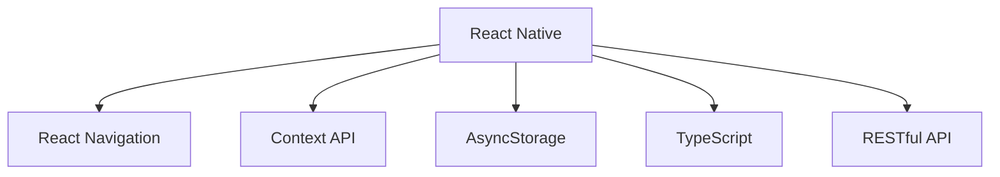
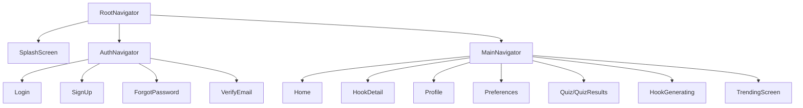
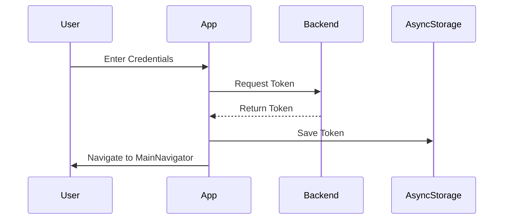

# HookED Frontend Documentation

## Table of Contents
1. [Introduction](#1-introduction)  
2. [Application Architecture](#2-application-architecture)  
3. [Project Structure](#3-project-structure)  
4. [Core Features](#4-core-features)  
5. [Navigation System](#5-navigation-system)  
6. [State Management](#6-state-management)  
7. [API Services](#7-api-services)  
8. [Authentication](#8-authentication)  
9. [UI Components](#9-ui-components)  
10. [Screens](#10-screens)  
11. [Installation and Setup](#11-installation-and-setup)  
12. [Development Guidelines](#12-development-guidelines)  
13. [Testing](#13-testing)  

---

## 1. Introduction

!!! info "What is HookED?"
    HookED is an educational mobile application designed to deliver engaging, bite-sized learning content called **"Hooks."**  
    These hooks aim to:
    - Spark curiosity
    - Deliver quick and interesting facts
    - Cover various educational topics

!!! tip
    HookED uses gamification elements like **streaks**, **XP**, and **badges** to enhance user engagement.

---

## 2. Application Architecture



* **Framework**: React Native (TypeScript)
* **Navigation**: React Navigation (stack & tab)
* **State Management**: Context API
* **Persistence**: AsyncStorage
* **Backend**: RESTful APIs

---

## 3. Project Structure

!!! note
    The project follows a modular structure. Add your actual folder breakdown here for more clarity.

---

## 4. Core Features

### 4.1 Content Discovery

* **Trending Hooks**: Popular content
* **Personalized Feed**: Based on user interactions
* **Search**: Explore specific topics
* **Topic Exploration**: Pre-defined topic categories

### 4.2 User Engagement

* **Daily Streak**
* **XP System**
* **Badges**
* **Quests**

### 4.3 Learning Experience

* **Hook Detail View**
* **Quizzes**
* **Rewards**

---

## 5. Navigation System



### 5.1 RootNavigator

* Controls main flow based on authentication state

### 5.2 AuthNavigator

* Login, SignUp, ForgotPassword, VerifyEmail

### 5.3 MainNavigator

* Home, HookDetail, Profile, Preferences, Quiz, HookGenerating, TrendingScreen

---

## 6. State Management

### 6.1 AuthContext

* Stores user info
* Manages login, logout, and registration

### 6.2 HooksContext

* Access and cache hook data
* Handle loading and refresh states

### 6.3 Local State

* Managed via `useState`, `useEffect`
* Persistent storage with AsyncStorage

---

## 7. API Services

### 7.1 `api.ts`

* `fetchHooks`, `fetchHookById`
* `searchHooks`, `fetchTrendingHooks`
* `fetchCuratedFeed`

### 7.2 `AuthService.ts`

* `login`, `register`, `logout`, `forgotPassword`

### 7.3 `ProfileService.ts`

* `updateTags`, `getUserProfile`

### 7.4 `InteractionService.ts`

* `logInteraction`, `logClick`, `logView`

### 7.5 `quizService.ts`

* `getQuestData`, `formatQuizQuestions`

---

## 8. Authentication

### 8.1 Flow



* Email/password login
* Token-based with AsyncStorage
* Auto-login on restart

### 8.2 User Data

* Synced on login
* XP/streak data handled server-side

---

## 9. UI Components

### 9.1 Navigation

* **HamburgerMenu**
* **Logo**

### 9.2 Content

* **TrendingHooks**
* **HookCard**

### 9.3 Interactive

* **Search**
* **TabContainer**

### 9.4 Status

* **XP Display**
* **Streak Display**
* **Badge Display**

---

## 10. Screens

### 10.1 HomeScreen

* Search
* XP, streaks, badges
* Tabs: Trending vs Personalized
* Topic exploration

### 10.2 TrendingScreen

* Swipeable feed
* XP rewards
* Confetti celebration

### 10.3 ProfileScreen

* Profile info
* Settings
* Achievements

### 10.4 QuizScreen

* Multiple choice
* Progress + XP

### 10.5 HookGeneratingScreen

* Animated loading
* Smooth transition to hook

### 10.6 HookDetailScreen

* Full content
* Related info
* Interactivity

---

## 11. Installation and Setup

### 11.1 Prerequisites

!!! warning
    Ensure all prerequisites are installed:

    * Node.js (v14+)
    * npm or yarn
    * React Native CLI
    * Xcode (iOS)
    * Android Studio (Android)

### 11.2 Environment Setup

Edit `env.ts`:

```ts
export const API_URL = 'https://your-api-endpoint.com';
```

### 11.3 Running the App

```bash
# Install dependencies
yarn install
# or
npm install

# For iOS
cd ios && pod install && cd ..
yarn ios

# For Android
yarn android
```

---

## 12. Development Guidelines

### 12.1 Code Style

* TypeScript best practices
* Functional components with hooks
* Alphabetized imports
* JSDoc for complex logic

### 12.2 State Management

* Use Context API for shared state
* Keep state local when appropriate
* Add loading indicators for async calls

### 12.3 UI/UX Principles

* Adhere to `colors.ts`
* Consistent padding/margin
* Responsive design
* Loading indicators for all fetches

---

## 13. Testing

### 13.1 Unit Testing

* **Jest** for services
* Mock APIs

### 13.2 Component Testing

* Test rendering & props behavior

### 13.3 E2E Testing

* **Detox** for device testing
