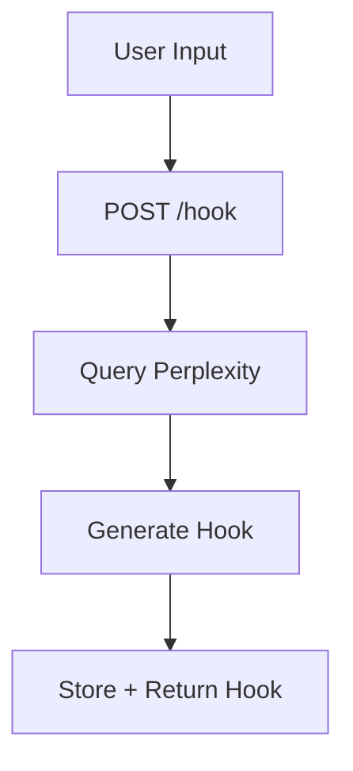
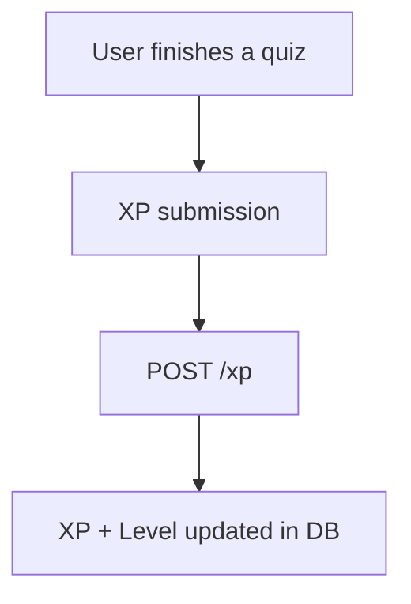
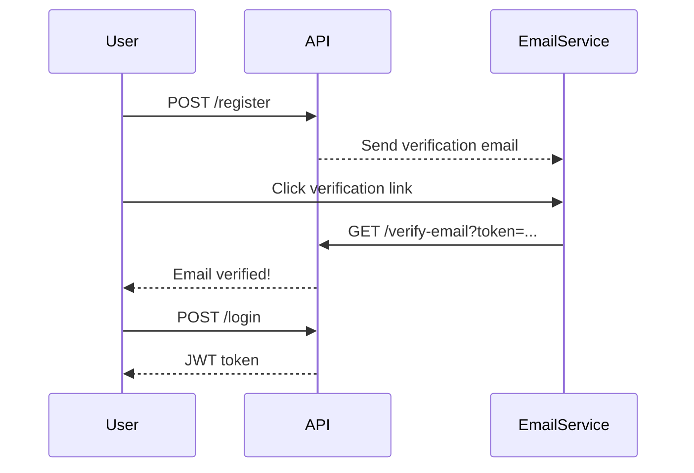

# API Routes Overview

This documentation provides a clear, categorized guide to all available routes in the Hooked App API, built with FastAPI.

!!! tip
    All authenticated routes expect a **JWT token** in the `Authorization` header as a Bearer token.

---

## Authentication

### `POST /api/auth/login`

Authenticate a user and receive a JWT.

### `POST /api/auth/register`

Register a new user.

!!! example "Example Request"
`bash
    curl -X POST https://yourapi.com/api/auth/login \
         -H "Content-Type: application/json" \
         -d '{"email": "test@example.com", "password": "secure"}'
    `

---

## Email Verification

### `GET /api/auth/verify-email?token=...`

Verifies email with the provided token.

!!! note
Token is sent via email upon registration.

---

## Profile Management

### `GET /api/profile/{profile_id}`

Retrieve profile data.

### `POST /api/profile/{profile_id}`

Update username or password.

### `PUT /api/profile/tags/{profile_id}`

Update user interest tags.

### `DELETE /api/profile/{profile_id}`

Delete user profile.

---

## Feed System

!!! info "This section powers the Hooked App's intelligent feed system."

### `POST /api/feed/hook`

Generates a **hook** using Perplexity AI.

### `GET /api/feed/curated/{profile_id}`

Returns a personalized feed using the **MPAD algorithm**.

### `GET /api/feed/trending/{id}`

Returns trending hooks using a **time-decay popularity model**.

### `GET /api/feed/search/{profile_id}`

Generates a hook + quiz from a user's search query.

!!! example "Example Response"
`json
    {
        "hook": "How did Rome fall?",
        "quiz": {
            "question": "Which year marks the fall of the Western Roman Empire?",
            "options": ["476 AD", "1066 AD", "1453 AD", "1776 AD"]
        }
    }
    `

---

## Interaction Logging

### `POST /api/interaction/log`

Logs hook interactions:

* `click`
* `like`
* `save`
* `share`

### `POST /api/interaction/popularity`

Updates time-decay popularity scores based on user interactions.

!!! tip
Used by the trending route to prioritize recent but highly engaged content.

---

## Gamification & XP

### `GET /api/quest/quiz/{profile_id}`

Generate N quizzes for the user.

### `POST /api/quest/xp/{profile_id}`

Update XP based on user actions.

!!! note
XP influences quest progress and possibly unlocks.

---

## Summary

| Category     | Route Prefix       | Tag                  |
| ------------ | ------------------ | -------------------- |
| Auth         | `/api/auth`        | `authentication`     |
| Verification | `/api/auth`        | `email verification` |
| Profile      | `/api/profile`     | `profile updates`    |
| Feed         | `/api/feed`        | `feed`               |
| Interaction  | `/api/interaction` | `user interaction`   |
| Quests       | `/api/quest`       | `gamification`       |

---

## Authentication Flow (JWT)

