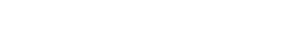
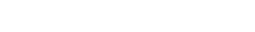

# Trending Feed Scoring Module

This module implements a **decayed popularity scoring algorithm** for generating a **trending hook feed**. It combines **engagement signals** with a **logarithmic time decay**, enabling the system to surface recently engaging content while naturally downranking older items.

> **Note:** This scoring logic is distinct from MPAD's interest-based feed generation. It focuses purely on *global popularity* without personalization or diversification.

---

## Overview

The scoring formula weighs a hook’s:

1. **Engagement Metrics** (views, likes, saves, shares)
2. **Age** (in days since creation)

The final score is a **decayed sum of weighted interactions**, favoring content that is both **popular and recent**.

---

## Scoring Formula

### `decayed_score(hook)`

#### Formula:



Where:

* 

*  : metric count on type i of hook h

*  : weight of metric $i$ from `POPULARITY_WEIGHTS`

*  : age of the hook in days

---

## Popularity Weights

```python
POPULARITY_WEIGHTS = {
    "viewCount": 0.1,
    "likeCount": 0.5,
    "saveCount": 0.8,
    "shareCount": 1.0,
}
```

These weights reflect the **relative value of different user actions**:

* Views provide weak signal
* Likes and saves reflect growing intent
* Shares are the strongest indicator of viral interest

---

## Time Decay

The decay factor:



This ensures that content becomes less relevant as it ages, unless sustained by interaction spikes.

---

## Integration in Feed Pipeline

### `update_popularity_scores()`

* Iterates over all hooks
* Computes their `decayed_score`
* Stores the score in `hook.metadata.popularity`

---

### `get_trending_feed(N)`

* Queries all hooks
* Sorts by `metadata.popularity` (descending)
* Returns top `N` hooks

---

## Output Format

Each result hook includes:

```json
{
  "title": "How to build an LLM app",
  "metadata": {
    "viewCount": 500,
    "likeCount": 120,
    "saveCount": 70,
    "shareCount": 50,
    "popularity": 93.12
  }
}
```

---

## Design Philosophy

This scoring module is:

* **Unpersonalized**: Same for all users
* **Lightweight**: Easily computable with basic metrics
* **Dynamic**: Changes with new interactions over time

